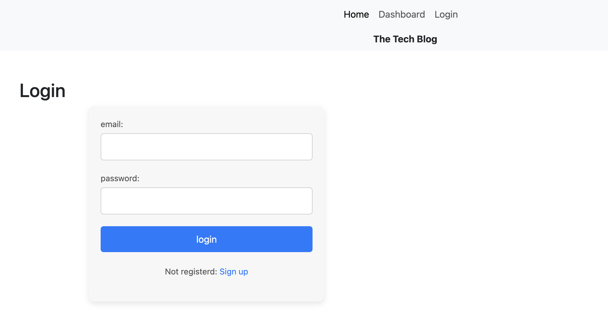
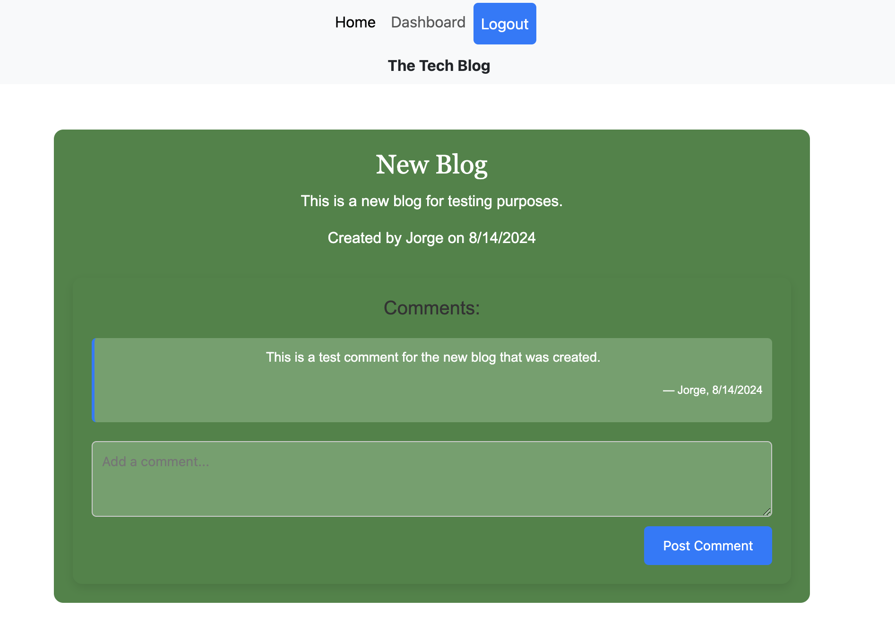

# MVC-TechBlog

 ## Table of Contents
- [Description](#description) 
- [Installation](#installation)
- [Usage](#usage)
- [Contributing](#contributing)
- [Test](#test)
- [Contact](#contact)
 

  ## Description

  The purpose of this project is to create a blog site where developers can publish their blog posts and comment on other developer's blogs aswell.

  
  
  
  website: https://mvc-techblog-755i.onrender.com
  ## Installation

  To install, clone Github repository and install on local machine.

  
  ## Usage

  For usage, Handlebars.js as the templating language, Sequelize as the ORM, and the express-session npm package for authentication.

  ## Contributing
  Jorge Guzman

  ## Test
  Insomnia was used to test the api routes on the backend. 
  
  ## Contact
  Email: jguzman913@gmail.com

  Github: https://github.com/JGuzman87/

